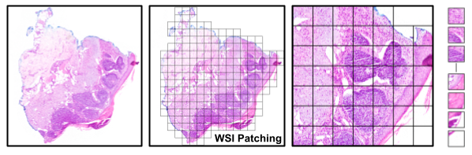
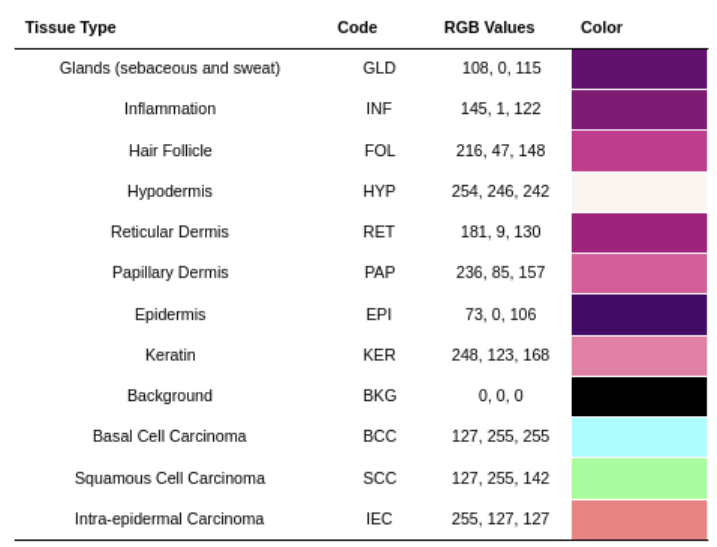

# WSI Patching for the Histopathology Non-Melanoma Skin Cancer Segmentation Dataset
 
This repository contains simple, open source code to create quickly a ready-to-use WSI patches dataset from the [Histopathology Non-Melanoma Skin Cancer Segmentation Dataset](https://espace.library.uq.edu.au/view/UQ:8be4bd0).\
As it is a small project made during an internship at MILA (Quebec Artificial Intelligence Institute), feel free to ask questions and modify this github !

## Segmentation
<div align="center" style="margin-top:20px; margin-bottom:20px;">
      
      <p style="font-size:75%;"><em></em></p>
</div>
The process consists of two main steps: first, splitting the WSI into patches; then, saving those patches into a new directory. 

The first step involves segmenting the WSI files into multiple patches. It assumes the user has downloaded the Histopathology dataset without alterations, placed under a directory named DATA_DIRECTORY.\
The structure of the folder is as follows :
```
DATA_DIRECTORY/
	├── data 
           ├── 1x
                ├── Images
                         ├──BCC_1.tif
                         └── ...
                └── Masks
                        ├──BCC_1.png 
                        └── ...
           ├── 2x
           ├── 5x
           ├── 10x
           └── ...
	└── ...
```
### Basic Run
```
python wsi_patching.py --source DATA_DIRECTORY --save_dir RESULTS_DIRECTORY --patch_size 256 --cancer_priority True --patch_level 1x
```
The above command segments every WSI in DATA_DIRECTORY into patches of size (256×256). It also segments the corresponding mask for each WSI into patches and generates a `.json` file containing the annotations for each patch.\
Finally it will generate the following folder structure at the specified RESULTS_DIRECTORY :
```
RESULTS_DIRECTORY/
	├── BCC_1 
           ├── Images
                    ├── patch_0.tif
                    ├── patch_1.tif
                    └── ...
           ├── Masks (Optionnal)
                   ├── mask_0.png
                   ├── mask_1.png
                   └── ...
           └── annotations.json
        ├── BCC_2
	└── ...
```
The annotations `.json` file lists the classes present in each patch for a given WSI. Its structure is as follows:
```
 { 
     "wsi_name" : BCC_1
     "patch_size" : args.patch_size
     "annotations" : [
      { 
          "patch_name" : "patch_0"
          "classes" : [
              "Hypodermis",
              "..."
          ]
      }, ... ]
 }
```

# Description of the dataset
All of the information bellow can be found on the [dataset page](https://espace.library.uq.edu.au/view/UQ:8be4bd0). For easy to use purposes it has been copied on this page.

This dataset is a collection of 290 images of non-melanoma skin cancer H&E tissue sections and hand-annotated segmentation masks. Access to a pre-existing collection of skin cancer slides was provided by MyLab Pathology (Salisbury, Australia). A pathologist selected 290 slides and specific tissue sections which were representative of typical cases of non-melanoma skin cancer. The cancer classes are Basal Cell Carcinoma (BCC - 140), Squamous Cell Carcinoma (SCC - 60) and Intra-Epidermal Carcinoma (IEC - 90). The set includes shave biopsies (100), punch biopsies (58) and excisional biopsies (132). The slides were produced using xylene processing and paraffin wax, and imaged over four months in late 2017 and early 2018. The slides were sourced from patients between the ages of 34 and 96, with a median age of 70 years. Female and male proportions were 2/3 and 1/3, respectively, closely reflecting the prevalence of non-melanoma skin cancer in the Australian population ( Staples et al., 2006 ). The slides were imaged using a DP27 Olympus microscope camera using the 10x magnification lens with the light condenser attached. Individual images were stitched together to build a high-resolution mosaic using software available at https://github.com/smthomas-sci/HistoImageStitcher . The resulting images had a resolution where 1 pixel corresponds to 0.67μm in length. The images are stored in TIF format. The segmentation masks were created in ImageJ, using colors to classify pixels into 12 tissue classes: Glands (GLD), Inflammation (INF), Hair Follicles (FOL), Hypodermis (HYP), Reticular Dermis (RET), Papillary Dermis (PAP), Epidermis (EPI), Keratin (KER), Background (BKG), BCC, SCC, and IEC. The color legend is available in the repository and the masks are stored in PNG format. The data are provided at smaller resolutions (2x, 5x and 10x downsample factors) as well as the original (1x). Cancer margin data is also available, which consist of (x,y) coordinates for the cancer margins for each image in CSV format. The training, validation and testing sets are provided to support benchmarking, and are the same used by Thomas et al. (2021). 

## Table of Classes
<div align="center" style="margin-top:20px; margin-bottom:20px;">
      
      <p style="font-size:75%;"><em></em></p>
</div>

## References

- Staples, M.P. , Elwood, M. , Burton, R.C. , Williams, J.L. , Marks, R. , Giles, G.G. , 2006. Non-melanoma skin cancer in Australia: the 2002 national survey and trends since 1985. Med. J. Aust. 184, 6–10 . Thomas, S. M., Lefevre, J. G., Baxter, G., & Hamilton, N. A. , 2021. Interpretable deep learning systems for multi-class segmentation and classification of non-melanoma skin cancer. Medical Image Analysis, 68, 101915. [Histopathology Non-Melanoma Skin Cancer Segmentation Dataset](https://espace.library.uq.edu.au/view/UQ:8be4bd0)
- Xu, Hanwen and Usuyama, Naoto and Bagga, Jaspreet and Zhang, Sheng and Rao, Rajesh and Naumann, Tristan and Wong, Cliff and Gero, Zelalem and González, Javier and Gu, Yu and Xu, Yanbo and Wei, Mu and Wang, Wenhui and Ma, Shuming and Wei, Furu and Yang, Jianwei and Li, Chunyuan and Gao, Jianfeng and Rosemon, Jaylen and Bower, Tucker and Lee, Soohee and Weerasinghe, Roshanthi and Wright, Bill J. and Robicsek, Ari and Piening, Brian and Bifulco, Carlo and Wang, Sheng and Poon, Hoifung. [A whole-slide foundation model for digital pathology from real-world data](https://github.com/prov-gigapath/prov-gigapath)
